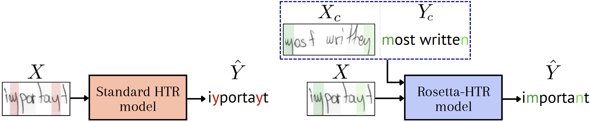
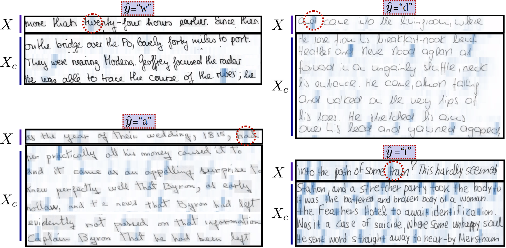
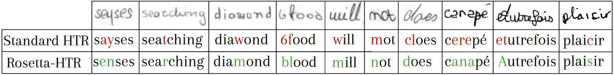

# FewShotWriterAdaptation

Official code for **"Few-Shot Writer Adaptation via Multimodal In-Context Learning"**, accepted at **ICDAR 2026**.

📄 Paper: [arXiv:2603.29450](https://arxiv.org/pdf/2603.29450)

## Overview

Standard Handwritten Text Recognition (HTR) models are trained once and applied uniformly to any writer, with no way to adapt to a specific handwriting style at inference time. This repository introduces **Rosetta-HTR**, a multimodal in-context learning approach: at inference, the model is given a small handwritten **context** $(X_c, Y_c)$ — a few image/transcription pairs from the *same* writer — alongside the query image $X$, and uses it to adapt its predictions on the fly, without any fine-tuning or gradient update.

<p align="center">
  
</p>

Given only the query image $X$, a standard HTR model has no writer-specific information to resolve ambiguous strokes. Rosetta-HTR instead conditions its prediction on a handwritten context $(X_c, Y_c)$ from the same writer, letting it recover the correct transcription ("important" instead of "iyportayt").

### How it adapts: cross-attention over the context

The model learns to align ambiguous strokes in the query with visually and contextually similar strokes in the provided context, using cross-attention between the query and the context images:

<p align="center">
  
</p>

Each panel shows the query line $X$ (top) and the context lines $X_c$ (bottom) the model attends to when predicting an ambiguous character $\hat{y}$. The highlighted regions in the context share the visual/writing pattern the model uses to disambiguate the circled character in the query.

### Result: better adaptation to writer-specific styles

By conditioning on a handwritten context, Rosetta-HTR corrects errors that a standard HTR model — with no access to writer-specific context — makes on ambiguous or unusual letter shapes:

<p align="center">
  
</p>

## Repository structure

```
.
├── generic_trainer.py        # Trainer class (training / evaluation loops) and entry point
├── config/                   # Experiment configurations (model, data, training)
├── model/                    # Model architecture (CNN encoder, Transformer decoders)
├── tokenizer/                # OCR / in-context tokenizers
├── data/                     # Dataloaders and synthetic/real dataset generation
└── utils/                    # Shared helper functions
```

## Citation

If you use this code, please cite:

```bibtex
@inproceedings{rosettahtr2026,
  title     = {Few-Shot Writer Adaptation via Multimodal In-Context Learning},
  booktitle = {International Conference on Document Analysis and Recognition (ICDAR)},
  year      = {2026}
}
```
